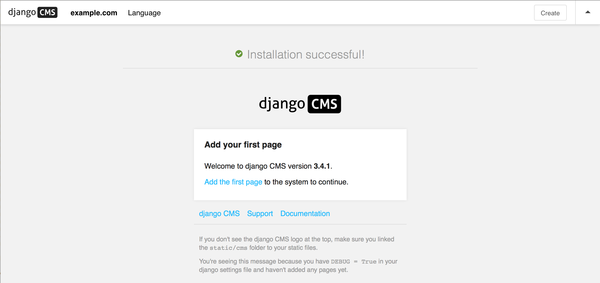

.. _installation:

#################################
How to install django CMS by hand（如何手动安装 django CMS）
#################################

安装django CMS最简单的方法是使用自动django CMS安装程序
<https://github.com/nephila/djangocms-installer>`_.
这是开始新项目的推荐方法，也是我们在本文档的教程部分中使用的方法。:ref:`tutorial section of this documentation <tutorials>`.

如果您喜欢手工操作，本指南将带您完成这个过程。

..  note::

    您还可以使用本指南帮助您将django CMS安装为现有项目的一部分。
    但是，本指南假设您从一个空白项目开始，因此您需要根据需要适当地调整下面的步骤。

您还可以使用本指南帮助您将django CMS安装为现有项目的一部分。
但是，本指南假设您从一个空白项目开始，因此您需要根据需要适当地调整下面的步骤。

******************************
Install the django CMS package
******************************

检查这个版本的Django CMS的Python/Django需求:ref:`Python/Django requirements <requirements>` 。

django CMS还有其他需求，它在 ``setup.py``中将其列为依赖项.

..  important::

    我们强烈建议在虚拟环境中执行以下所有步骤。
    您应该知道如何使用virtualenv创建、激活和处理虚拟环境。
    如果没有，可以使用下面的步骤开始，但是建议您在继续之前花几分钟学习使用virtualenv的基础知识。

    ..  code-block:: bash

        virtualenv django-cms-site  # create a virtualenv
        source django-cms-site/bin/activate  # activate it

在一个激活的virtualenv中，运行::

	pip install --upgrade pip

确保pip是最新的，因为早期版本可能不太可靠。
然后::

    pip install django-cms

安装最新稳定版本的django CMS。

****************************************
Create a new project
****************************************

创建一个新项目::

    django-admin.py startproject myproject

如果这对您来说是新的，您应该阅读官方的Django教程<https://docs.djangoproject.com/en/dev/intro/tutorial01/>`_，它涵盖了启动一个新项目。

项目结构如下::

    myproject
        myproject
            __init__.py
            settings.py
            urls.py
            wsgi.py
        manage.py

********************************************
最小需要的应用程序和设置
********************************************

在文本编辑器中打开新项目的``settings.py``文件。

INSTALLED_APPS
==============

您需要将以下内容添加到它的 ``INSTALLED_APPS``列表中::

    'django.contrib.sites',
    'cms',
    'menus',
    'treebeard',

* django CMS需要使用django的 :mod:`django:django.contrib.sites` 网站框架. 你只需设置 ``SITE_ID``
  为 - ``SITE_ID = 1`` 就足够了.
* ``cms`` and ``menus`` 是CMS的核心模块.
* `django-treebeard <http://django-treebeard.readthedocs.io>`_ 用于管理django CMS的页面和插件树结构。

django CMS安装django CMS管理风格。这提供了一些样式，帮助django CMS管理组件更容易使用。
从技术上讲，它是一个可选组件，不需要在您的项目中启用，但强烈推荐使用它。

In the ``INSTALLED_APPS``, **before** ``django.contrib.admin``, add::

    'djangocms_admin_style',

Language settings（语言设置）
=================

django CMS要求您设置语言设置。这应该列出您希望您的项目提供的所有语言，并且必须包含LANGUAGE_CODE中的语言。

For example::

    LANGUAGES = [
        ('en', 'English'),
        ('de', 'German'),
    ]

(为了简单起见，在这个阶段，将默认的en-us更改为en是值得的，因为您将在LANGUAGE_CODE设置中发现它。)

********
Database（数据库）
********

django CMS需要一个关系数据库后端。每个django CMS安装都应该有自己的数据库

您可以使用SQLite，它包含在Python中，不需要单独安装或进一步配置。
您不太可能将其用于生产中的项目，但是它非常适合开发和探索，特别是在新的Django项目的数据库中默认配置了它。

..  note::

    为了进行部署，您需要使用Django中的一个可用于生产的数据库。
    `PostgreSQL`_ 或者 `MySQL`_.

    安装和维护数据库系统远远超出了本文档的范围，但是在系统各自的网站上都有很好的文档。

    无论你使用哪个数据库，都需要安装适当的Python适配器:

    .. _PostgreSQL: http://www.postgresql.org/
    .. _MySQL: http://www.mysql.com

    Whichever database you use, it will also require the appropriate Python adaptor to be installed::

        pip install psycopg2     # for Postgres
        pip install mysqlclient  # for MySQL

    请参考 :setting:`Django's DATABASES setting documentation <django:DATABASES>` 
    Django的数据库设置文档，以获得所选数据库后端的适当配置。

Database tables
===============

现在运行迁移，为新的应用程序创建数据库表:::

    python manage.py migrate

Admin user
==========

创建一个管理超级用户::

    python manage.py createsuperuser

*************************************
Using ``cms check`` for configuration
*************************************

一旦您完成了上面描述的最小所需设置，您就可以使用django CMS的内置CMS check命令来帮助您识别和安装其他组件。运行:

    python manage.py cms check

这将检查配置、应用程序和数据库，并报告任何问题。

..  note::

    如果缺少关键组件，django CMS将无法运行CMS检查命令，只会引发一个错误。

在下面的每个步骤之后，运行cms检查，以验证您已经解决了清单中的项目。

Sekizai
=======

CMS要求`Django Sekizai <https://github.com/ojii/django-sekizai>`_ 用于静态文件管理。你需要::

     'sekizai'

``INSTALLED_APPS``列出, and::

    'sekizai.context_processors.sekizai'

in the ``TEMPLATES['OPTIONS']['context_processors']``:

..  code-block:: python
    :emphasize-lines: 7

    TEMPLATES = [
        {
            ...
            'OPTIONS': {
                'context_processors': [
                    ...
                    'sekizai.context_processors.sekizai',
                ],
            },
        },
    ]

Middleware
==========

in your :setting:`django:MIDDLEWARE` you'll need :class:`django:django.middleware.locale.LocaleMiddleware` -
it's **not** installed in Django projects by default.

Also add::

    'cms.middleware.user.CurrentUserMiddleware',
    'cms.middleware.page.CurrentPageMiddleware',
    'cms.middleware.toolbar.ToolbarMiddleware',
    'cms.middleware.language.LanguageCookieMiddleware',

to the list.

你同意可以添加``'cms.middleware.utils.ApphookReloadMiddleware'``. 
这不是绝对必要的，但很有用。如果包括在内，应该在列表的开头。

Context processors（上下文处理器）
==================

Add ``'cms.context_processors.cms_settings'`` to ``TEMPLATES['OPTIONS']['context_processors']``.

Also add ``'django.template.context_processors.i18n'`` if it's not already present.

``cms check`` 现在应该无法识别项目的任何其他问题。但是，还需要一些额外的配置。

******************************
Further required configuration 进一步需要的配置
******************************

URLs
====

在项目的 ``urls.py``,向``urlpatterns``列表中添加``url(r'^', include('cms.urls'))``。
它应该紧跟在其他模式之后，以便检测其他应用程序的特定url。

您还需要导入 ``django.conf.urls.include``. For example:

..  code-block:: python
    :emphasize-lines: 1,5

    from django.conf.urls import url, include

    urlpatterns = [
        url(r'^admin/', admin.site.urls),
        url(r'^', include('cms.urls')),
    ]

django CMS项目现在将运行, 您将看到是否使用 ``python manage.py runserver``启动它。
您可以通过 http://localhost:8000/ 访问它, 通过 http://localhost:8000/admin/ 访问管理员.
但实际上你还不能用它做任何有用的事情。

.. _basic_template:

Templates
=========

django CMS的页面至少需要一个模板。``CMS_TEMPLATES``列表中的第一个模板将是项目的默认模板。

::

    CMS_TEMPLATES = [
        ('home.html', 'Home page template'),
    ]

在项目的根目录中，创建一个 ``templates``目录, and in that, ``home.html``, a minimal django CMS
template:

..  code-block:: html+django

    
    <html>
        <head>
            <title></title>
            
        </head>
        <body>
            
            
            
        </body>
    </html>

这一点值得详细解释一下:

* ```` 加载我们在模板中使用的模板标记库。
* ```` 提取页面的``page_title`` :ttag:`属性 <page_attribute>`.
* ```` and ```` 是Sekizai模板标记，它们加载Django应用程序定义的HTML块。
  django CMS为CSS和JavaScript定义了块，并且需要这两个标记。
  我们建议在``</head>``标签前放置 ```` , ``</body>``前放置````标签.
* ```` 渲染 :ttag:`django CMS toolbar <cms_toolbar>`.
* ```` 定义可以插入插件的占位符。,模板至少需要一个````模板标记才能对django CMS有用。
 占位符的名称只是一个描述性的名称，供您参考。

Django需要知道在哪里可以找到它的模板，, 所以将`templates``添加到``TEMPLATES['DIRS']``列表中:

..  code-block:: python
    :emphasize-lines: 4

    TEMPLATES = [
        {
            ...
            'DIRS': ['templates'],
            ...
        },
    ]

..  note::

    我们在这里设置模板的方法只是为了说明。在实际项目中，我们建议创建一个``base.html``模板，
    由项目中的所有应用程序共享，django CMS模板可以扩展它。

    有关模板继承如何工作的更多信息，请参阅Django的模板语言文档。
    :ref:`template language documentation <django:template-inheritance>` 

Media and static file handling 媒体和静态文件处理
==============================

django CMS站点需要处理:

* *静态文件**，它是应用程序或项目的核心部分，如必要的图像、CSS或JavaScript

* *媒体文件**, 由站点的用户或应用程序上载的

默认情况下，在新项目的设置中定义`django:STATIC_URL`(为“/static/”)。
`django:STATIC_ROOT`, 是将静态文件复制到其中并从中提供服务的位置，
它不需要用于开发 - :doc:`只需要用于生产 <django:howto/deployment/checklist>`.

现在，在您的设置中使用runserver和DEBUG = True，您不需要担心这两个问题。

但是，需要将MEDIA_URL(将提供媒体文件的地方)和MEDIA_ROOT(将存储它们的地方)添加到您的设置中::

    MEDIA_URL = "/media/"
    MEDIA_ROOT = os.path.join(BASE_DIR, "media")

对于部署，您需要配置适当的媒体文件服务。只用于开发目的，以下内容将在您的``urls.py`` 中有效::

..  code-block:: python
    :emphasize-lines: 1,2,6

    from django.conf import settings
    from django.conf.urls.static import static

    urlpatterns = [
        ...
    ] + static(settings.MEDIA_URL, document_root=settings.MEDIA_ROOT)

(有关在生产中提供媒体文件的指导，请参阅Django文档。
<django:howto/static-files/index>`.)

*************************************
Adding content-handling functionality 添加内容处理功能
************************************* 

现在，您已经为django CMS站点设置了基本内容，该站点能够管理和提供页面。
然而，到目前为止，该项目还没有安装插件，这意味着它无法处理这些页面中的内容。
django CMS中的所有内容都是通过插件管理的。因此，我们现在需要安装一些附加应用程序来提供插件和其他功能。

您实际上不需要安装任何这些。django CMS不会向您提交任何特定的内容处理应用程序。
但是，这里列出的功能提供了关键的功能，强烈推荐使用。

Django Filer
============

`Django Filer`_ 提供文件和映像管理。
许多其他应用程序也依赖于Django Filer——Django CMS站点不运行Django Filer是非常不寻常的。
本节中的配置将帮助您开始，但是您应该参考Django Filer文档以获得更全面的配置信息。

.. _Django Filer: https://github.com/divio/django-filer

To install::

    pip install django-filer

许多应用程序将作为依赖项安装。
简单的缩略图<https://github.com/SmileyChris/easy-thumbnails>`需要创建不同大小的图像的新版本;
Django MPTT <https://github.com/django-mptt/django-mptt/>在Django Filer中管理文件夹的树结构。

将安装Python图像库Pillow<https://github.com/python-pillow/Pillow>。
Pillow需要一些系统级的库——Pillow文档详细描述了在各种操作系统上运行这个功能需要什么。

Add::

    'filer',
    'easy_thumbnails',
    'mptt',

to ``INSTALLED_APPS``.

You also need to add::

    THUMBNAIL_HIGH_RESOLUTION = True

    THUMBNAIL_PROCESSORS = (
        'easy_thumbnails.processors.colorspace',
        'easy_thumbnails.processors.autocrop',
        'filer.thumbnail_processors.scale_and_crop_with_subject_location',
        'easy_thumbnails.processors.filters'
    )

需要为Django Filer和简单的缩略图创建新的数据库表，所以运行迁移::

    python manage.py migrate filer
    python manage.py migrate easy_thumbnails

(or simply, ``python manage.py migrate``).

Django CMS CKEditor
===================

`Django CMS CKEditor`_ 是django CMS默认的文本编辑器.

.. _Django CMS CKEditor: https://github.com/divio/djangocms-text-ckeditor

Install: ``pip install djangocms-text-ckeditor``.

Add ``djangocms_text_ckeditor`` to your ``INSTALLED_APPS``.

运行迁移::

    python manage.py migrate djangocms_text_ckeditor

Miscellaneous plugins 其他插件
=====================

django CMS中有很多插件，涵盖了很多功能。首先，能够依赖一组维护良好的插件来满足一些一般的内容管理需求是很有用的。

* `djangocms-link <https://github.com/divio/djangocms-link>`_
* `djangocms-file <https://github.com/divio/djangocms-file>`_
* `djangocms-picture <https://github.com/divio/djangocms-picture>`_
* `djangocms-video <https://github.com/divio/djangocms-video>`_
* `djangocms-googlemap <https://github.com/divio/djangocms-googlemap>`_
* `djangocms-snippet <https://github.com/divio/djangocms-snippet>`_
* `djangocms-style <https://github.com/divio/djangocms-style>`_
* `djangocms-column <https://github.com/divio/djangocms-column>`_

To install::

    pip install djangocms-link djangocms-file djangocms-picture djangocms-video djangocms-googlemap djangocms-snippet djangocms-style djangocms-column

and add::

    'djangocms_link',
    'djangocms_file',
    'djangocms_picture',
    'djangocms_video',
    'djangocms_googlemap',
    'djangocms_snippet',
    'djangocms_style',
    'djangocms_column',

to ``INSTALLED_APPS``.

Then run migrations::

    python manage.py migrate.

这些和其他插件在一些常用的插件中有更详细的描述。`django CMS市场 <https://marketplace.django-cms.org/en/addons/>` 列出了更多可用的插件。

******************
Launch the project 启动项目
******************

Start up the runserver::

    python manage.py runserver

并访问新站点，现在您应该能够通过 ``http://localhost:8000``访问该站点。如果还没有登录，请登录。

|it-works-cms|

**********
Next steps
**********

如果这是您的第一个django CMS项目，请阅读本教程，了解一些基础知识。

开发人员教程将帮助您了解如何作为开发人员使用django CMS。
注意，本教程假设您已经使用django CMS安装程序安装了CMS，但是稍加修改就可以将其用作基础。

要在生产web服务器上部署django CMS项目，请参考 :doc:`django部署文档
<django:howto/deployment/index>`.
